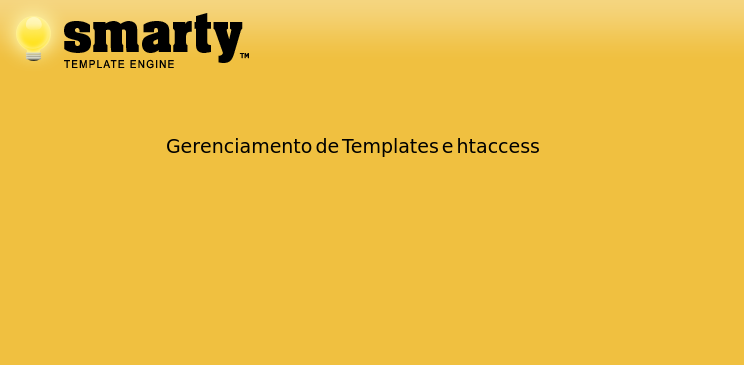

## Gerenciamento de Templates e URL amigáveis

Pré Requisitos:

&nbsp;&nbsp;&nbsp;&nbsp;&bull; Apache (Qualquer versão) configurado para ler e interpretar o .htaccess
&nbsp;&nbsp;&nbsp;&nbsp;&bull; PHP 5.2 ou superior
&nbsp;&nbsp;&nbsp;&nbsp;&bull; Linux (Não testei no Windows)

Após ter os pré requisitos, crie uma pasta para o seu protejo exemplo "projeto_x", estando dentro dela crie o arquivo .htaccess com o seguinte conteúdo:

```
<IfModule mod_rewrite.c>
RewriteEngine on
RewriteCond %{REQUEST_FILENAME} !-f
RewriteCond %{REQUEST_FILENAME} !-d
RewriteRule ^(.*)$ index.php?route=$1 [L,QSA]
</IfModule>
```

Baixe o Smarty pela url https://www.smarty.net/download após extrair deve existir uma pasta chamada "smarty-3.1.33"

Crie uma pasta chamada "templates_c", esta terá permissões especiais, coloque as permissões como 777.

Crie uma pasta chamada "templates" e dentro desta crie uma pasta chamada "default", estas pastas não requerem nenhuma permissão especial

Na "raiz" do seu "projeto_x" crie o arquivo index.php com o seguinte conteúdo:

```
<?php

require_once "smarty-3.1.33/libs/Smarty.class.php";
$smarty = new Smarty();
$smarty->template_dir = "templates/default";
$smarty->compile_dir = "templates_c";

$array['nome'] = "Paulo";
$array['email'] = "nome@dominio.com.br";

$params = $_GET;

$smarty->assign("array", $array);
$smarty->assign("params", $params);

$smarty->display('index.tpl');
```

Na pasta "templates/default" crie o arquivo index.tpl com o seguinte conteúdo:

```
<html>
<head>
<title>Smarty</title>
</head>
<body>
Nome: {$array['nome']}
<br>
E-mail: {$array.email}
<br>
GET: {$params.route}
</body>
</html>
```

O Smarty é bem simples de usar, bem documentado (em inglês, veja na url https://www.smarty.net/documentation), pense em usar ele no seu próximo projeto :)